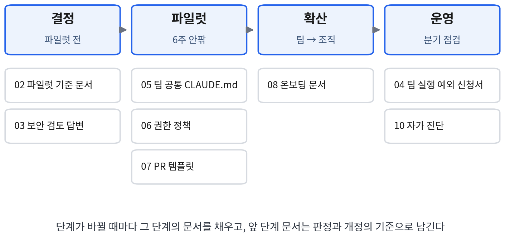

# 팀 도입 키트 안내

『팀을 위한 클로드 코드 완벽 가이드』의 문서 양식 팩이다. 클로드 코드를 팀에
도입하고 운영하는 과정에서 필요한 문서 7종(02~08)을, 본문 사례(paylog·notihub·
minishop)의 실제 파일을 바탕으로 그대로 채워 쓸 수 있게 묶었다.

이 문서들은 선택 사항이 아니라 본문이 각 단계의 **결정을 기록하는 수단**으로
제시한 것이다. 파일럿 기준을 문서로 확정하지 않으면 결과에 따라 기준이 바뀌어
파일럿이 끝나지 않는다(6.1.2). 권한 정책을 문서로 두지 않으면 허용 범위가
늘어나기만 한다(14.1). PR 템플릿에 가정 섹션이 없으면 코드에 없는 전제가 결합
시점에야 드러난다(9.3.3). 각 양식은 그 결정을 빠뜨리지 않게 하는 최소 형식이다.

## 구성

| 파일 | 무엇을 결정하는가 | 작성 시점 | 작성·승인 | 본문 |
|---|---|---|---|---|
| 02_파일럿_기준_문서_양식.md | 파일럿의 대상·기간·성공 기준·실패 기준 | 파일럿 시작 전 | 리드 작성, 조직 승인 | 6.1.2, 예제 6.1 |
| 03_보안_검토_답변_양식.md | 계약·데이터 범위·기술 통제의 사실 확인 | 보안·법무 검토 요청 시 | 기술 담당 작성, 보안팀 검토 | 6.4, 예제 6.2 |
| 04_팀_실행_예외_신청서_양식.md | 에이전트 팀 실행의 손익과 승인 | 팀 실행 착수 전 | 실행자 작성, 리드 승인 | 15.2.1, 표 15.3 |
| 05_팀_공통_CLAUDE.md_예시.md | 팀 공통 규칙(구조·명령·계약·규약·금지) | 파일럿 시작 시 | 리드 작성, 개정은 7.5.2 절차 | 7.1.1, 예제 7.1 |
| 06_권한_정책_문서_예시.md | 기본 권한 모드와 계획 검토 의무 작업 | 파일럿 시작 시 | 리드 작성 | 7.3, 예제 7.9 |
| 07_PR_템플릿_예시.md | PR마다 명시할 가정과 결합 전 확인 | 공정 표준화 시 | 팀 합의 | 9.3.3, 예제 9.11 |
| 08_온보딩_문서_예시.md | 신규 입사자의 첫 주 읽기 순서와 문의처 | 확산 시작 시 | 리드 작성, 신규 입사자가 갱신 | 8.3, 예제 8.4 |

## 도입 단계별 배치

**결정 단계(파일럿 전)**에서는 02와 03을 작성한다. 02는 채택·산출·체감의 세
지표와 실패 판정 기준(사용 정착·품질 악화·보안 차단)을 시작 전에 숫자로 확정하는
문서다. 03은 보안 검토가 도입 막바지에 일정을 멈추지 않도록, 학습 사용·보존·
데이터 범위·기술 통제를 근거 문서와 확인일로 미리 정리하는 문서다.

**파일럿 단계**에서는 05·06·07을 저장소에 배치한다. 파일 이름은 각 문서 머리의
원래 경로(CLAUDE.md, docs/policies/permissions.md, .github/pull_request_template.md)를
따른다. 05는 "무엇을 넣고 무엇을 뺄 것인가"(7.1.1)의 기준대로 반복되는 정보만
담는다. 개인 취향에 해당하는 설정은 개인 설정에 남긴다.

**확산 단계**에서는 08로 온보딩을 표준화한다. 온보딩 문서는 규칙의 원본이 아니라
읽는 순서와 문의처를 안내하는 문서이므로, 규칙 자체는 05·06에만 둔다.

**운영 단계**에서는 에이전트 팀을 시험할 때 04를 적용한다. 분기마다 10(자가
진단)으로 표준의 상태를 점검한다. 손익이 세 차례 이상 검증된 작업 유형은 예외에서
표준 사용으로 전환한다.

## 사용할 때 지킬 것

- 예시로 적힌 팀·수치·날짜·파일 경로는 본문 사례의 값이다. 조직의 값으로 교체한다.
- 양식의 항목은 늘리기보다 줄이는 편이 낫다. 본문의 notihub에서는 예외 신청서가
  번거로워 구성원이 개인 설정으로 우회했고, 양식을 절반으로 줄인 뒤에야 신청
  기록이 실제 사용을 반영하게 되었다(17.3.2).
- 05·06·07은 저장소에 커밋되는 파일이므로 개정 이력이 Git에 남는다. 표준 수정은
  7.5.2의 거버넌스(제안·검토·반영)를 따른다.
