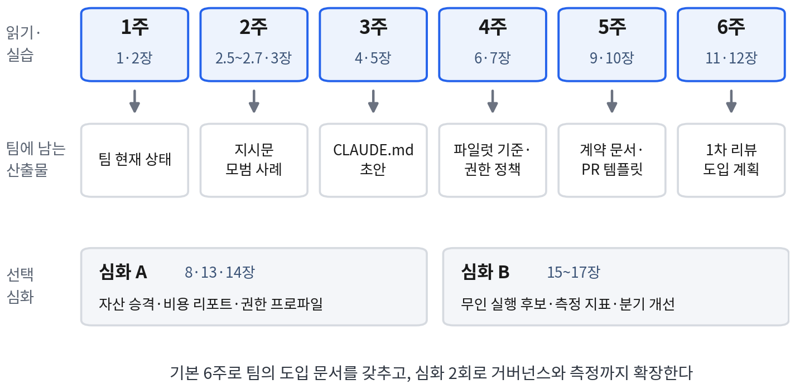

# 팀 스터디 가이드

『팀을 위한 클로드 코드 완벽 가이드』를 팀 단위로 학습하는 커리큘럼이다. 6주 기본
과정과 심화 2회로 구성한다. 주 1회 90분 모임을 기준으로 한다. 이 책은 개인의
사용법이 아니라 팀의 표준과 공정을 다루므로, 스터디의 목표도 "책을 다 읽는 것"이
아니라 **매주 팀에 남는 산출물을 하나씩 만드는 것**으로 설정한다. 6주가 끝나면
팀의 CLAUDE.md 초안, 파일럿 기준 문서, 인터페이스 계약 1건, PR 템플릿, 1차 리뷰
도입 계획이 저장소에 남아 있어야 한다.

## 운영 방식

**모임 구성(90분)**

| 시간 | 활동 | 진행 요령 |
|---|---|---|
| 15분 | 읽기 요약 | 진행자가 아니라 참가자 한 명이 돌아가며 그 주의 핵심을 5분 안에 정리한다 |
| 25분 | 실습 결과 공유 | 사전 실습에서 진행이 어려웠던 지점과 예상과 다른 결과를 먼저 다룬다. 성공 사례보다 실패 사례의 학습 효과가 크다 |
| 35분 | 토론 | 아래 주차별 질문을 "우리 팀에 적용하면"으로 바꿔 묻는다. 책 내용 확인이 아니라 결정을 내리는 시간이다 |
| 15분 | 산출물 결정 | 토론 결과를 산출물 초안에 반영하고 담당자와 마감을 정한다 |

**원칙**

- 읽기와 실습은 모임 전에 각자 마친다. 모임에서 책을 읽지 않는다.
- 산출물은 저장소의 `docs/adoption/` 같은 한곳에 커밋해 스터디 자체를 기록으로
  남긴다. 스터디가 끝난 뒤 이 폴더가 팀의 도입 문서가 된다.
- 토론 질문에 정답을 맞히려 하지 않는다. 본문의 minishop·notihub 사례는 판단의
  기준을 제시한 것이다. 답은 팀마다 다르다.

**참가자 구성**

- 5명 이하: 전원이 전 과정을 함께 한다.
- 6~15명: 실습 공유는 2~3명씩 소그룹으로 나누고, 토론과 산출물 결정은 전체가 한다.
- 팀 리드·엔지니어링 매니저: 1장을 읽은 뒤 4주차(6·7장)부터 합류해도 된다. 단,
  5·6주차의 계약·리뷰 결정에는 반드시 참여한다.

**사전 준비(스터디 전 주)**

- 예제 저장소를 클론하고 부록 A의 실습 환경(클로드 코드, Node.js 22 이상,
  Python 3.11 이상, jq, gh)을 갖춘다. 각 장 폴더의 README.md를 먼저 읽는다.
- 전원이 2장의 첫 세션 실습(hello-todo)을 마치고 모이면 1주차 토론이 구체적으로
  진행된다.

---

## 1주차 — 변화의 이해와 첫 세션

- **목표**: 팀이 겪는 문제를 이 책의 용어(작업 결합 오류·공유되지 않는 노하우·비용 편차)로
  진단할 수 있다.
- **읽기**: 1장 전체, 2장 2.1~2.4
- **사전 실습**: hello-todo(2장 폴더)에서 첫 세션을 진행한다. 기능 추가를 위임하고,
  변경을 검토해 승인하고, 한 번은 Esc로 중단하고, 한 번은 되돌리기를 사용한다.
- **토론**
  1. 우리 팀의 도구 사용은 1.1.1의 세 세대 중 어디에 있는가. 팀원마다 다른가.
  2. 1.3의 세 문제(결합 시점 오류, 공유되지 않는 노하우, 비용 편차) 가운데 이미
     겪은 사례를 하나씩 말해 보면 무엇이 나오는가.
  3. 산출물을 검증하지 않고 받아들인 경험(바이브 코딩)이 있었다면 그때 무엇이
     검증을 생략하게 했는가.
- **산출물**: 팀 현재 상태 한 쪽(사용 도구, 활용 수준, 겪는 문제 3건). 이 문서가
  6주 뒤 개선 여부를 비교하는 기준선이 된다.
- **진행자 메모**: 첫 주의 논의는 도구 기능 질문으로 옮겨 가기 쉽다. 기능 질문은
  부록 C와 2장으로 돌리고, 토론은 팀의 문제에 집중시킨다.

## 2주차 — 동작 원리와 워크플로

- **목표**: 같은 지시에 다른 결과가 나오는 이유를 설명하고, 불완전한 지시문을
  개선할 수 있다.
- **읽기**: 2.5~2.7(에이전틱 루프, 컨텍스트 윈도, 권한 모드), 3장
- **사전 실습**: moneylog(3장 폴더)에서 "환불 처리가 이상하다"는 제보를 받은
  상황을 재현한다. 표 3.1의 네 단계 질문으로 구조를 파악하고, 플랜 모드로 계획을
  먼저 받아 검토한 뒤 수정한다. 같은 지시를 새 세션에서 한 번 더 실행해 경로가
  달라지는지 확인한다.
- **토론**
  1. 두 번 실행한 결과가 달랐다면 어디에서 갈렸는가. 팀은 이 변동을 어떻게 다루고
     있는가(재시도, 리뷰, 무시).
  2. 최근 팀원이 실제로 쓴 지시문 하나를 가져와 표 3.2의 네 전략으로 고쳐 보면
     무엇이 빠져 있었는가.
  3. 플랜 모드가 필수인 작업을 팀 기준으로 정한다면 어떤 작업인가(3.1.3의
     되돌리기 어려운 결정 기준).
- **산출물**: 팀의 지시문 모범 사례 3건(목표·제약·판정 기준이 모두 있는 형태)과
  플랜 모드 의무 작업 목록 초안
- **진행자 메모**: 2.5.1의 확률적 생성 설명은 리뷰와 평가가 필요한 이유를 다루는
  이후 장들의 근거다. 이 주에 해당 내용을 확실히 정리해야 5·6주차 토론이 수월하다.

## 3주차 — 컨텍스트 설계와 확장 기능

- **목표**: 팀 저장소의 CLAUDE.md에 넣을 것과 뺄 것을 판단하고, 반복 작업을
  커맨드·훅 후보로 식별할 수 있다.
- **읽기**: 4장, 5장
- **사전 실습**: paylog(4장 폴더)의 packages/api에서 /init으로 CLAUDE.md 초안을
  만들고 예제 4.2와 비교한다. paylog(5장 폴더)에서 /review와 /commit을 실행하고,
  .env 수정을 지시해 보호 훅이 차단하는 것을 확인한다.
- **토론**
  1. /init이 만든 초안에서 4.1.2의 기준(반복되는 정보만, 파생 가능한 정보 제외)에
     어긋나는 줄은 무엇인가.
  2. 우리 팀에서 매주 반복되는 지시 세 가지를 꼽으면 무엇이고, 그중 커맨드로
     만들 것과 훅으로 강제할 것은 어떻게 갈리는가(권고 vs 강제, 5.2.2).
  3. 서브에이전트로 분리하면 좋을 역할이 있는가(리뷰어, 조사, 문서).
- **산출물**: 실제 저장소의 CLAUDE.md 초안 1건(도입 키트 05 참고), 커맨드·훅
  후보 목록(각각 권고/강제 표시)
- **진행자 메모**: CLAUDE.md 초안은 이 시점에 완성하지 않는다. 4주차의 권한
  정책과 7.1.1의 "넣을 것과 뺄 것" 기준으로 한 번 더 걸러낸다.

## 4주차 — 도입 전략과 팀 공통 환경

- **목표**: 파일럿의 성공·실패 기준을 숫자로 확정하고, 강제할 규칙과 권고할
  규칙을 구분한 팀 환경을 설계할 수 있다.
- **읽기**: 6장, 7장
- **사전 실습**: 도입 키트의 02(파일럿 기준 문서)와 03(보안 검토 답변)를 각자
  작성해 온다. notihub(7장 폴더)에서 `echo '<이벤트 JSON>' | python
  .claude/hooks/guard_commands.py`로 차단 훅을 단독 검증한다.
- **토론**
  1. 각자 써 온 파일럿 기준을 비교하면 채택·산출·체감 지표의 수치가 얼마나
     다른가. 하나로 합칠 때 무엇을 기준으로 삼는가(6.1.2의 paylog 예: 활성 80%,
     병합 시간 20% 단축, 반려율·결함률 악화 없음, 지속 사용 70%).
  2. 실패 판정 기준(사용 정착·품질 악화·보안 차단) 가운데 우리 조직에서 실제로
     발동할 가능성이 높은 것은 무엇인가.
  3. 7.3의 기준으로 우리 팀 규칙을 강제(훅·권한 규칙)와 권고(CLAUDE.md)로 나누면
     어느 쪽이 많은가. 강제가 많다면 왜인가.
- **산출물**: 파일럿 기준 문서 확정본, 팀 권한 정책 초안(도입 키트 06 참고),
  3주차 CLAUDE.md 초안의 2차 개정
- **진행자 메모**: 리드가 이 주에 합류한다면 사전 실습 대신 02·03 작성만 요청한다.
  6.5의 도입 반대 논리를 미리 읽어 두면 조직 설득 논의가 구체적이 된다.

## 5주차 — 작업 결합과 Git 전략

- **목표**: 팀에서 계약으로 만들 결정을 식별하고, 결합 전 검증과 PR 크기 기준을
  정할 수 있다.
- **읽기**: 9장, 10장(8장은 심화 A로 미룬다)
- **사전 실습**: minishop(9장 폴더)에서 examples/before_contract/의 결합 실패
  재현 스크립트를 실행해 장부가 맞지 않는 것을 확인한다. 계약 테스트
  `python -m pytest tests/test_pricing_contract.py -v`를 실행한다. minishop(10장
  폴더)에서 견본을 복사한 뒤 `claude --worktree <이름>`으로 두 세션을 병렬로 연다.
- **토론**
  1. 최근 우리 팀에서 결합 시점에 드러난 어긋남을 하나 떠올리면, 9.1.2의 세 원인
     (명세 부재·컨텍스트 불일치·암묵적 가정) 중 무엇이었는가.
  2. 9.2.1의 판별 질문 세 개(둘 이상이 의존하는가, 결합 시점에야 드러나는가,
     바꾸려면 여러 곳을 고쳐야 하는가)를 우리 코드에 적용하면 계약으로 만들 결정은
     무엇인가. 세 개만 고른다.
  3. PR 크기 상한을 정한다면 몇 줄인가. 10.1.1의 400줄 기준이 우리 리뷰 용량에
     맞는가.
- **산출물**: 인터페이스 계약 문서 1건(예제 9.5 형식), PR 템플릿 적용(도입 키트
  07), PR 크기·브랜치 수명 기준
- **진행자 메모**: 재현 스크립트의 결과(주문마다 1,200원 손해)를 먼저 제시하면
  계약의 필요성이 별도 설명 없이 드러난다. 실습을 건너뛴 참가자가 있으면 모임에서
  2분 안에 실행해 결과를 제시한다.

## 6주차 — 리뷰와 품질

- **목표**: 리뷰 병목의 현재 단계를 진단하고, 1차 리뷰 자동화의 적용 범위와
  사람 리뷰의 영역을 정할 수 있다.
- **읽기**: 11장, 12장
- **사전 실습**: minishop(11장 폴더)의 리뷰어 서브에이전트 3종(contract·security·
  convention)의 정의를 읽고, 계약을 위반하는 변경을 만들어 `@agent-contract-reviewer`
  에게 리뷰를 맡긴다. minishop(12장 폴더)에서 `python evals/run_evals.py`로 평가
  세트를 실행한다(claude CLI 필요).
- **토론**
  1. 표 11.1의 리뷰 품질 붕괴 다섯 단계(큐 형성 → 압축 리뷰 → 형식적 승인 → 결함
     통과 → 신뢰 붕괴) 중 우리 팀은 어디에 있는가. 근거가 되는 신호는 무엇인가.
  2. 1차 리뷰를 자동화한다면 어떤 관점의 리뷰어를 먼저 두는가. 오탐이 반복될 때
     누가 리뷰어 정의를 고치는가(11.2.2).
  3. 사람 리뷰가 반드시 맡아야 할 판단(11.3.1)과, 사람의 리뷰 역량을 유지할 장치
     (11.3.2)를 우리 팀에서는 무엇으로 두는가.
- **산출물**: 1차 리뷰 도입 계획(적용 저장소, 리뷰어 관점, 오탐 관리 절차, 사람
  리뷰 필수 조건), 테스트·문서 품질 기준 초안(12.2)
- **진행자 메모**: 6주차 마지막 15분은 1주차 산출물(팀 현재 상태)과 지금까지의
  산출물을 나란히 놓고, 무엇이 결정되었고 무엇이 미뤄졌는지 확인하는 데 쓴다.
  미뤄진 항목은 자가 진단(10_자가진단.md)의 진단 C로 목록화한다.

---

## 심화 A — 노하우 자산화와 비용·보안 거버넌스

- **읽기**: 8장, 13장, 14장
- **사전 실습**: notihub(8장 폴더)에서 `/plugin marketplace add ./claude-plugins`로
  사내 마켓플레이스를 등록해 플러그인을 설치한다. notihub(13장 폴더)에서
  `python ops/weekly_cost_report.py spend_this_week.csv spend_last_week.csv`로 주간
  비용 리포트를 만든다. notihub(14장 폴더)의 payments-api에서 deny 규칙이 동작하는
  것을 확인한다.
- **토론**: 어떤 노하우를 자산으로 승격할지의 기준(8.1.2)과 심사 주체. 비용 편차를
  "고비용 사용자"가 아니라 "설명되지 않은 사용"으로 다루는 어휘(13.1.2)에 팀은
  동의하는가. 최소 권한 프로파일을 적용할 첫 저장소는 어디인가(14.1.1).
- **산출물**: 자산 승격 절차 초안, 주간 비용 리포트 운영안(주기·공개 범위·알림
  임계), 권한 프로파일 초안 1건

## 심화 B — 자동화와 성과 측정

- **읽기**: 15장, 16장, 17장
- **사전 실습**: notihub(16장 폴더)에서 `sh ops/report_comment.sh spend_this_week.csv spend_last_week.csv`로 헤드리스 실행을,
  `sh ops/nightly_migrate.sh`로 야간 배치를 실행한다(API 키 필요, jq 필요). 자가
  진단(10_자가진단.md) 세 가지를 각자 수행해 온다.
- **토론**: 무인 실행에 맡길 수 있는 작업의 자격(16.3.1)에 우리 백로그의 어떤 작업이
  해당하는가. 표 17.2의 네 단계(전달, 활용, 품질·표준, 자산·성장) 중 지금 측정할 수
  있는 지표는 무엇인가. 자가 진단 결과에서 팀원 간 응답이 갈린 문항은 무엇이며
  왜 갈렸는가.
- **산출물**: 무인 실행 후보 목록과 한도 설계(턴·예산·중단 조건), 팀 측정
  대시보드 지표 선정, 다음 분기 개선 항목 3건

---

## 완주 점검

스터디가 끝났을 때 `docs/adoption/`에 다음이 있어야 한다.

- [ ] 팀 현재 상태 문서(1주차)와 6주 뒤의 변화 기록
- [ ] 지시문 모범 사례 3건, 플랜 모드 의무 작업 목록
- [ ] CLAUDE.md 초안(2차 개정), 커맨드·훅 후보 목록
- [ ] 파일럿 기준 문서 확정본, 권한 정책 초안
- [ ] 인터페이스 계약 1건, PR 템플릿, PR 크기·브랜치 수명 기준
- [ ] 1차 리뷰 도입 계획, 테스트·문서 품질 기준 초안

여섯 항목 가운데 넷 이상이 남았다면 스터디는 목적을 달성한 것이다. 남지 않은
항목은 해당 주차의 토론이 결정으로 이어지지 않은 것이므로, 그 장만 다시 읽고
결정만 내리는 짧은 모임을 한 번 더 연다.
