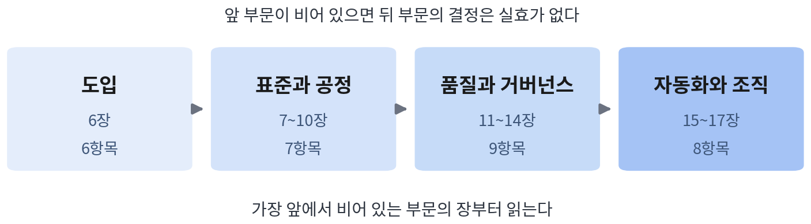

# 도입 조직 자가 진단

『팀을 위한 클로드 코드 완벽 가이드』의 본문 기준을 세 가지 진단으로 옮긴 것이다.
각 진단은 쓰는 시점과 답하는 사람이 다르다.

| 진단 | 언제 | 누가 | 무엇을 알게 되는가 |
|---|---|---|---|
| A. 기반 관행 점검 | 도입 결정 전, 또는 도입이 기대만큼 효과가 없을 때 | 리드 | 지금 필요한 것이 도구인지 표준인지 |
| B. 안티패턴 조기 신호 | 운영 중 분기마다 | 리드와 구성원이 각자 | 사고로 이어지기 전의 실패 패턴과 그 교정의 첫걸음 |
| C. 리더 결정 점검 | 도입 단계가 바뀔 때마다 | 리드 | 아직 내리지 않은 결정과 그 결정을 미룬 대가 |

**진행 방법**: 구성원이 있는 진단(B)은 각자 답한 뒤 합산한다. 리드의 답과 구성원의
답이 다른 문항이 조직의 실제 상태에 가장 가깝다. 결과는 아래 기록 양식에 남겨
다음 분기와 비교한다.

---

## 진단 A — 기반 관행 점검 (본문 17.3)

안티패턴의 대부분은 기반의 부재에서 발생한다. 도구를 바꾸기 전에 다섯 가지를 확인한다.

| # | 질문 | 아니오라면 |
|---|---|---|
| 1 | 모든 변경이 버전 관리와 PR을 거치는가? | 에이전트의 산출물을 검토할 지점 자체가 없다. 리뷰(11장)와 게이트(9.3.3)를 도입할 기반부터 만들어야 한다 |
| 2 | 변경은 독립적으로 배포하고 롤백할 수 있는 크기로 나누어져 있는가? | 생성 속도가 올라가면 큰 변경이 더 빨리 쌓인다. PR 크기와 브랜치 수명 기준(10.1)이 먼저다 |
| 3 | 도구 사용 방침이 문서화되어 있으며 구성원이 그 위치를 알고 있는가? | 팀마다, 사람마다 다른 방식이 굳어진다. 팀 공통 CLAUDE.md와 권한 정책(7장)부터 시작한다 |
| 4 | 효과를 확인할 수 있는 측정 체계가 하나라도 운영되고 있는가? | 도입 효과를 인상으로 판단하게 되고, 반대 논리에 답하지 못한다. 파일럿 기준(6.1.2)이 최소 측정 체계다 |
| 5 | 사고와 실패를 기록하고 복기하는 절차가 있는가? | 같은 사고가 반복되고 예외가 늘어난다. 사고 대응 플레이북(14.3.4)과 회고(17.2.2)가 필요하다 |

**판정**: "아니오"가 세 개 이상이면 지금 필요한 것은 더 나은 도구가 아니라 표준과
도입 체계다. 이 책의 3부(6~8장)로 돌아간다. 하나 또는 둘이라면 해당 항목의 장만
먼저 읽고 4부로 진행한다.

예를 들어 1·3번만 "아니오"인 팀(PR 없이 직접 푸시, 방침 문서 없음)은 도구 도입보다
PR 기반 작업 흐름(10.1)과 팀 CLAUDE.md(05)를 먼저 만들어야 한다. 그 둘이 없으면
에이전트의 산출물을 검토할 지점도, 세션이 따를 규칙도 없다.

---

## 진단 B — 안티패턴 조기 신호 (본문 17.3, 표 17.6·17.7)

각 문항에 "예"라고 답하면 해당 안티패턴의 조기 신호가 나타난 것이다. 신호의 위치
열은 그 신호를 확인하는 곳을 가리킨다. 교정의 첫걸음 열은 지금 해야 할 일을
가리킨다.

| # | 지금 우리 팀은… | 안티패턴 | 신호의 위치 | 교정의 첫걸음 |
|---|---|---|---|---|
| 1 | 가드레일(차단 훅)의 실행이 0에 수렴하거나 특정 규칙에만 집중된다 | 방치된 표준 | 훅 실행 기록(7.5.3) | 표준 개정 절차를 가동하고 규칙과 워크플로의 충돌 여부를 확인 |
| 2 | PR 승인까지의 시간이 실제 검토가 어려울 정도로 짧다 | 리뷰 스킵 | 리뷰 지표(11.3.2) | 리뷰 용량을 재배정하고 1차 리뷰 자동화를 도입 |
| 3 | 주간 비용 리포트 없이 월별 청구서만 확인한다 | 비용 방임 | 사용량 집계(13.3) | 주간 리포트와 기준선 대비 배수 알림부터 마련 |
| 4 | 무인 실행의 실패율이 높아지는데도 대상 범위는 계속 늘고 있다 | 과잉 자동화 | 배치 결과·아침 리포트(16.3) | 선별 기준을 다시 적용하고 실패 작업의 무인 실행 자격을 회수 |
| 5 | 도입 효과를 묻는 질문에 기준선 데이터로 답하지 못한다 | 전면 도입 강행 | 측정 체계 부재(6장) | 기준선을 측정하고 확산 속도를 조정 |
| 6 | PR 수가 늘면서 PR의 평균 크기도 함께 커진다 | 산출량 평가 | 배치 크기 추세(17.1) | 평가 기준에서 산출량을 제외(17.4.2) |
| 7 | 수용률과 활용도의 개인별 편차가 계속 벌어진다 | 요령의 사일로 | 분석 대시보드(13.2.1) | 8장의 공유회와 챔피언 제도를 가동 |
| 8 | 재작업률과 결합 충돌이 병렬 작업 수와 함께 증가한다 | 게이트 없는 병렬 | 게이트 기록(9.3.3) | 게이트 통과를 병합 조건으로 강제 |
| 9 | 권한 allow 목록이 늘어나기만 하고 줄어들지 않는다 | 권한 방임 | 설정 이력(14.1) | 권한 프로파일을 재적용하고 예외에 기한을 설정 |
| 10 | 주니어의 이의 제기와 직접 수정이 줄고 있다 | 주니어 방치 | 리뷰 기록(11.3.2) | 17.4.1의 연습 설계 적용 |

**판정과 읽는 법**

- "예"가 하나라도 있으면 해당 행의 첫걸음을 이번 분기 안에 실행한다.
- 안티패턴은 연쇄된다(17.3.2). 리뷰 스킵(2)이 나타나면 상류의 산출량 평가(6)와
  비용 방임(3)을 함께 점검한다. 활용이 위축되었다면 최근의 비용 정책을 확인한다.
  신호 하나가 나타났을 때 그 상류 조건까지 점검하는 조직이 사고를 미리 막는다.
- 교정 완료는 조치 실행이 아니라 신호의 정상화로 판정한다. 본문의 notihub는 권한
  프로파일을 재적용해 allow 목록 증가를 멈췄다. 그러나 예외 신청은 늘지 않았고,
  확인 결과 구성원이 개인 설정으로 우회하고 있었다. 신청서를 절반으로 줄인 뒤에야
  신호가 정상으로 돌아왔다(17.3.2).

**문항별 확인 방법(데이터의 출처)**

| # | 확인 방법 | 비교 기준 |
|---|---|---|
| 1 | 차단 훅의 실행 기록(훅이 남긴 로그 또는 7.5.3의 기록 방식)을 규칙별로 집계 | 분기 전과 비교. 0에 수렴하거나 한 규칙이 대부분이면 신호 |
| 2 | PR 생성→승인 시각의 차이를 저장소 API로 집계해 변경 줄 수와 함께 확인 | 줄 수 대비 검토 시간이 실제 읽기 속도보다 짧으면 신호 |
| 3 | 13.3.2의 주간 리포트 존재 여부 자체가 답이다 | 리포트가 없으면 "예" |
| 4 | 무인 배치의 아침 리포트에서 실패율 추세와 대상 건수 추세를 나란히 확인 | 실패율↑·대상↑가 동시면 신호 |
| 5 | 파일럿 기준 문서(02)의 판정 기록이 있는가 | 기록이 없으면 "예" |
| 6 | 저장소 API로 주별 PR 수와 평균 변경 줄 수를 집계 | 둘이 함께 증가하면 신호 |
| 7 | 13.2.1 분석 대시보드의 개인별 수용률·활용도 분산 | 분산이 분기마다 커지면 신호 |
| 8 | 재작업 PR 비율과 병합 충돌 건수를 동시 진행 작업 수와 함께 확인 | 병렬 작업 수와 함께 오르면 신호 |
| 9 | settings.json의 permissions.allow 항목 수를 Git 이력으로 추적 | 늘기만 하고 줄어든 적이 없으면 "예" |
| 10 | 리뷰 코멘트에서 주니어의 이의 제기·직접 수정 건수를 분기별로 집계 | 감소 추세면 신호 |

데이터가 없는 문항은 "확인 불가"로 기록한다. 확인 불가가 셋 이상이면 측정 체계
자체가 없다는 뜻이므로 17.1로 돌아간다.

---

## 진단 C — 리더 결정 점검 (부록 B.4, 표 B.7~B.10)

각 항목이 팀에서 "결정되어 문서로 존재하는가"를 확인한다. 오른쪽 열은 그 결정을
미루었을 때 발생하는 결과다. 미결정 항목이 곧 리드의 할 일 목록이 된다.

### 도입 단계 (6장)

| 결정되었는가 | 결정 항목 | 정하지 않으면 | 참조 |
|---|---|---|---|
| [ ] | 파일럿 팀과 기간, 작업 범위 | 효과를 관찰하기 어려운 조건에서 도입 여부를 판단하게 된다 | 6.1.1 |
| [ ] | 성공 기준과 실패 판정 기준 | 결과에 따라 기준이 바뀌어 파일럿이 종료되지 않는다 | 6.1.2 |
| [ ] | 확산 일정과 구간별 판정 지점 | 준비 없이 적용 인원만 늘어난다 | 6.1.3 |
| [ ] | 계약 경로와 시트 배정 기준 | 비용 구조와 사용량 집계 위치가 구성원마다 달라진다 | 6.2 |
| [ ] | 혼용 환경의 표준화 범위 | 도구 통일을 강제하거나 방치하는 양극단으로 흐른다 | 6.3 |
| [ ] | 데이터 정책의 확인 범위와 보안 검토 담당 | 도입 막바지에 보안 검토로 일정이 중단된다 | 6.4 |

### 표준과 공정 (7~10장)

| 결정되었는가 | 결정 항목 | 정하지 않으면 | 참조 |
|---|---|---|---|
| [ ] | 공통 지침에 넣을 것과 개인에게 맡길 것 | 팀 규칙과 개인의 취향이 뒤섞여 규칙이 지켜지지 않는다 | 7.1 |
| [ ] | 강제할 규칙과 권고할 규칙의 구분 | 모든 규칙이 권고로 전락하거나 모든 규칙이 장벽이 된다 | 7.3, 7.4 |
| [ ] | 표준의 개정 권한과 절차 | 갱신되지 않은 지침이 남아 표준 전체의 신뢰도가 떨어진다 | 7.5.2 |
| [ ] | 자산 승격의 심사 주체와 기준 | 개인의 노하우가 공유되지 않거나 검증 없이 배포된다 | 8.1.2, 8.2.2 |
| [ ] | 작업 분할 단위와 인터페이스 계약의 작성 시점 | 결합 단계에 오류가 집중된다 | 9.2, 9.3 |
| [ ] | 게이트 통과 조건과 자동화 범위 | 검증이 사람의 성실성에 의존하게 된다 | 9.3.3 |
| [ ] | 브랜치 수명과 PR 크기의 기준 | 리뷰가 감당하기 어려운 규모의 변경이 누적된다 | 10.1 |

### 품질과 거버넌스 (11~14장)

| 결정되었는가 | 결정 항목 | 정하지 않으면 | 참조 |
|---|---|---|---|
| [ ] | 1차 리뷰의 적용 범위와 리뷰어 정의 | 자동 리뷰가 노이즈가 되어 무시된다 | 11.2 |
| [ ] | 사람 리뷰의 필수 조건과 병합 차단 기준 | 승인 절차가 형식적으로 운영된다 | 11.3.1, 9.3.3 |
| [ ] | 리뷰 역량 유지 장치 | 검증할 수 없는 승인자가 늘어난다 | 11.3.2 |
| [ ] | 테스트와 문서에 요구할 기준 | 생성량은 늘지만 검증 역량은 그대로 남는다 | 12.1, 12.2 |
| [ ] | 작업 유형별 모델 배정과 기본값 | 동일한 작업의 비용이 구성원마다 크게 달라진다 | 13.3.1 |
| [ ] | 비용 리포트의 주기와 공개 범위, 이상 감지 임계 | 청구서가 도착한 뒤에야 문제를 발견한다 | 13.3.2, 13.3.3 |
| [ ] | 프로젝트별 권한 프로파일과 예외 승인 절차 | 편의를 위해 확대된 권한이 회수되지 않는다 | 14.1.1 |
| [ ] | 확장 재료의 설치 허용 기준과 검증 주체 | 공급망 경로로 통제 밖의 코드가 유입된다 | 14.2.2 |
| [ ] | 사고 대응의 역할 분담과 기록 보존 정책 | 사고 원인의 규명이 늦어진다 | 14.3 |

### 자동화와 조직 (15~17장)

| 결정되었는가 | 결정 항목 | 정하지 않으면 | 참조 |
|---|---|---|---|
| [ ] | 에이전트 팀을 사용할 작업의 기준 | 조율 비용이 병렬화의 이득을 넘어선다 | 15.2 |
| [ ] | 무인에 맡길 작업의 자격 조건 | 검증하기 어려운 작업이 무인 실행으로 넘어간다 | 16.3.1 |
| [ ] | 무인 실행의 한도와 중단 조건 | 사람이 없는 시간에 사고가 확대된다 | 16.3.2 |
| [ ] | 자동화의 권한 범위와 저장소 설정 | 자동화가 완료되지 못하거나 과도한 권한을 갖게 된다 | 16.2, A.3 |
| [ ] | 측정할 지표와 보고 주기 | 산출량이 성과의 대용으로 사용된다 | 17.1 |
| [ ] | 계획과 리추얼의 재설계 범위 | 작업 속도와 회의 주기가 맞지 않는다 | 17.2 |
| [ ] | 안티패턴 점검의 주기와 담당 | 문제가 사고로 이어진 뒤에야 발견된다 | 17.3.2 |
| [ ] | 주니어의 의도적 연습 설계와 평가 기준의 조정 | 검증 역량을 갖춘 인력이 더 이상 충원되지 않는다 | 17.4 |

**판정**: 부문별로 미결정 항목을 센다. 네 부문의 순서(도입 → 표준과 공정 → 품질과
거버넌스 → 자동화와 조직)는 본문의 진행 순서이자 의존 순서다. 앞 부문이 비어 있으면
뒤 부문의 결정은 실효가 없으므로, 가장 앞에서 비어 있는 부문의 장부터 읽는다.
모든 항목을 한 번에 결정할 필요는 없다. 팀이 그 단계에 도달했을 때 해당 부문이
채워져 있으면 충분하다.

---

## 결과 해석 예

가상의 12인 팀이 도입 두 분기째에 진단한 결과다.

- 진단 A: "아니오" 1개(5번 사고 복기 절차 없음) → 기반은 갖춰졌다. 14.3.4의 플레이북만 보강한다.
- 진단 B: 리드는 2번(리뷰 스킵)만 "예"라고 답했으나 구성원 다수는 2번과 9번(권한
  방임)에 "예"라고 답했다 → 리드가 확인하지 못한 신호가 9번이다. allow 목록의 Git
  이력을 확인하니 두 분기 동안 열한 항목이 늘고 하나도 줄지 않았다. 2번의 상류
  조건으로 6번(산출량 평가)을 함께 점검했더니 PR 수와 평균 크기가 함께 늘고 있었다.
- 진단 C: 도입 0 / 표준·공정 1(표준 개정 절차 미결정) / 품질·거버넌스 3(리뷰 역량
  유지 장치, 권한 예외 승인 절차, 사고 대응 역할) / 자동화·조직 6 → 자동화·조직은
  아직 해당 단계에 이르지 않았으므로 정상이다. 품질·거버넌스의 3건이 이번 분기의
  할 일이다. 이 3건은 진단 B의 2번·9번과 정확히 겹친다.

이번 분기 조치는 세 가지로 정해졌다. 표준 개정 절차 문서화(7.5.2), 권한 예외 승인
절차와 예외 기한 설정(14.1.1, B-9의 첫걸음), 리뷰 용량 재배정과 1차 리뷰 자동화
검토(11.2, B-2의 첫걸음). 평가 기준에서 산출량을 제외하는 논의(17.4.2)는 다음 분기
안건으로 넘겼다.

## 결과 기록 양식

| 항목 | 내용 |
|---|---|
| 진단일 | |
| 응답자(리드 / 구성원 수) | |
| 진단 A: "아니오" 개수와 항목 | |
| 진단 B: "예" 문항 번호(리드 답 / 구성원 다수 답) | |
| 진단 C: 부문별 미결정 수(도입 / 표준·공정 / 품질·거버넌스 / 자동화·조직) | |
| 이번 분기 조치(문항 번호 → 첫걸음 → 담당 → 기한) | |
| 다음 진단 예정일 | |

같은 양식으로 분기마다 기록하면 진단 B의 "예" 개수와 진단 C의 미결정 수가 줄어드는
추세 자체가 도입의 진척을 보여 주는 지표가 된다.
